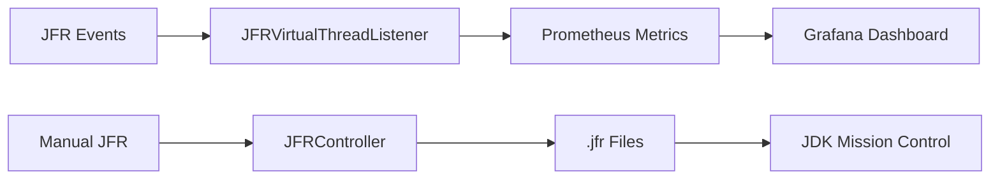

# README

## 🧭 Project Overview
This repo contains a Spring Boot demo for comparing **platform threads** vs **virtual threads** under load with comprehensive **JFR (Java Flight Recorder)** monitoring and real-time metrics visualization. You can flip virtual threads on/off and change the HTTP port **without** modifying `application.properties`.

## ▶️ Quick Run (Disable Virtual Threads, Use Port 8081)
Use this when you want a **baseline with platform threads** and to run on a **non-default port (8081)**.

```bash
# Run Spring Boot with virtual threads DISABLED and server port set to 8081 (works on Windows/macOS/Linux)
mvn spring-boot:run -Dspring-boot.run.arguments="--spring.threads.virtual.enabled=false --server.port=8081"
```

- This passes **Spring Boot application arguments** (not JVM `-D` flags).
- Same command works in **Windows (CMD/PowerShell)** and **macOS/Linux**.

### 📈 JMeter CLI: Run & Generate HTML Report
Windows (single line, write **JTL** to **..\jtl** and **HTML report + log** to **..\report**)

```bash
jmeter -n -t Rest_Call_Test_Plan.jmx -l ..\jtl\Rest_Call_Test_Plan.jtl -j ..\report\jmeter.log -e -o ..\report\Rest_Call_Test_Report -f
```

**Flags:**
- -n non-GUI mode
- -t test plan (.jmx)
- -l results (.jtl)
- -j JMeter run log
- -e -o dir_name generate HTML dashboard
- -f overwrite output dir

### Optional Variants

```bash
# Default port (8080), virtual threads ENABLED (JDK 21+)
mvn spring-boot:run -Dspring-boot.run.arguments="--spring.threads.virtual.enabled=true"

# Pass as JVM system properties (alternative approach)
mvn spring-boot:run -Dspring-boot.run.jvmArguments="-Dspring.threads.virtual.enabled=false -Dserver.port=8081"
```

## 🔌 Endpoints
- GET `/order/hello` → simple health/demo endpoint
- GET `/order/placeorder/{productId}` → demo flow that calls a service (e.g., DB or simulated I/O)
- GET `/jfr` → JFR recording control dashboard
- GET `/vt-test.html` → Virtual thread test runner UI

## 🎯 JFR Monitoring Features

### Automatic Monitoring
- **Real-time JFR streaming** → Prometheus metrics
- **Spring Boot lifecycle integration**
- **Configurable via properties** (`jfr.enabled=true/false`)

### Manual Control
- **REST API** for on-demand recordings
- **File-based recordings** for JDK Mission Control analysis
- **Independent of automatic monitoring**

### Virtual Thread Testing
- **Burst tests** (mass VT creation)
- **Pinning simulation** (synchronized blocks)
- **Sustained workloads** (long-running VTs)

## 🏗️ Architecture

### Core JFR Components

#### 1. **JFRVirtualThreadUtil** (Framework-agnostic)
```java
// Pure Java utility - no Spring dependencies
public class JFRVirtualThreadUtil {
    // Creates JFR recordings with VT events enabled
    public static Recording createVirtualThreadRecording(String name)
    
    // Sets up real-time event streaming
    public static RecordingStream createEventStream(...)
    
    // File operations and resource management
    public static Path saveRecording(Recording recording, String outputDir)
}
```

#### 2. **JFRVirtualThreadListener** (Spring Integration)
```java
@Component
public class JFRVirtualThreadListener {
    // Automatic lifecycle management
    @EventListener(ApplicationReadyEvent.class)
    public void startJFRMonitoring()
    
    // Prometheus metrics export
    private final Counter startCounter;
    private final Timer pinnedTimer;
}
```

#### 3. **JFRController** (Manual Control)
```java
@RestController
@RequestMapping("/jfr")
public class JFRController {
    // REST API for manual JFR control
    @GetMapping("/start") // Start recording
    @GetMapping("/stop")  // Stop & save to file
    @GetMapping("/status") // Check recording state
}
```

## 🚀 Key Features

### Automatic Monitoring
- **Real-time JFR streaming** → Prometheus metrics
- **Spring Boot lifecycle integration**
- **Configurable via properties** (`jfr.enabled=true/false`)

### Manual Control
- **REST API** for on-demand recordings
- **File-based recordings** for JDK Mission Control analysis
- **Independent of automatic monitoring**

### Virtual Thread Testing
- **Burst tests** (mass VT creation)
- **Pinning simulation** (synchronized blocks)
- **Sustained workloads** (long-running VTs)

## 📊 Monitoring Stack



### Exported Metrics
- `jfr_virtual_thread_starts_total` - VT creations
- `jfr_virtual_thread_ends_total` - VT completions
- `jfr_virtual_thread_pinned_seconds` - Pinning duration histogram
- `jfr_virtual_thread_pinned_events_total` - Total pinning events

## 🧪 Quick JMeter Recipe
- Charts to watch: **Active Threads Over Time**, **Response Times Over Time**, **Transactions Per Second**

## 📋 Features
- Toggle **virtual threads** on/off via app args
- Compare throughput/latency under blocking vs non-blocking handlers
- Ready for **JMeter** closed-loop load tests
- **Comprehensive JFR monitoring** with real-time metrics
- **Manual JFR recording control** via REST API
- **Interactive web dashboards** for testing and monitoring

## 🧰 Tech Used
- **Java 21** with virtual threads
- **Spring Boot 3.x** (Tomcat NIO)
- **JFR** for low-overhead monitoring
- **Micrometer + Prometheus** for metrics
- **Grafana** for visualization
- **Docker Compose** for monitoring stack
- **Maven**
- **JMeter** (external, optional for load tests)

## ✅ Prerequisites
- JDK **21**
- Maven **3.9+**
- Docker (optional, if you later use Testcontainers or Dockerized DB)
- JMeter (optional, for load testing)

## 🚀 Build & Run

```bash
# Build
mvn clean verify

# Run (baseline: platform threads on 8081)
mvn spring-boot:run -Dspring-boot.run.arguments="--spring.threads.virtual.enabled=false --server.port=8081"

# Run (virtual threads on 8080)
mvn spring-boot:run -Dspring-boot.run.arguments="--spring.threads.virtual.enabled=true"
```

## 📊 Start Monitoring Stack

```bash
# Start Prometheus + Grafana
docker-compose up -d

# Access Grafana dashboard
open http://localhost:3000/d/virtual-thread-metrics
```

## 🎮 User Interfaces

### 1. JFR Dashboard (`/jfr` → `jfr-dashboard.html`)
```html
<!-- Manual JFR recording control -->
<button onclick="handleJFRAction('/jfr/start')">▶️ Start Recording</button>
<button onclick="handleJFRAction('/jfr/stop')">⏹️ Stop Recording</button>
```

### 2. VT Test Runner (`vt-test.html`)
```html
<!-- Virtual thread event generation -->
<button onclick="runTest('burst', 'count=500')">🚀 Burst Test</button>
<button onclick="runTest('pinning', 'count=10')">📌 Pinning Test</button>
```

## ⚙️ Configuration

### Enable/Disable Virtual Threads
```properties
# Toggle between platform and virtual threads
spring.threads.virtual.enabled=true

# JFR monitoring control
jfr.enabled=true
jfr.output.dir=jfr-recordings
```

### Quick Start Commands
```bash
# Platform threads (baseline)
mvn spring-boot:run -Dspring-boot.run.arguments="--spring.threads.virtual.enabled=false --server.port=8081"

# Virtual threads (comparison)
mvn spring-boot:run -Dspring-boot.run.arguments="--spring.threads.virtual.enabled=true"
```

## 🔍 Working with `jdk.internal.vm.Continuation` in IntelliJ IDEA
`jdk.internal.vm.Continuation` is an internal JDK API used by Project Loom to implement virtual threads. If you explore it directly, allow access via VM options.

### Step 1: Add VM Options (Run/Debug Configuration → VM Options)

```bash
--add-exports java.base/jdk.internal.vm=ALL-UNNAMED
--enable-preview
```

**Notes:**
- `--enable-preview` is required only on **JDK 19/20**.
- On **JDK 21+**, virtual threads are stable; keep `--enable-preview` only if you use other preview features.

### Step 2: Debugger Additional Command Line Parameters

```bash
--enable-preview --add-exports java.base/jdk.internal.vm=ALL-UNNAMED
```

This lets the debugger step into `Continuation` frames if you dive deep.

## 👤 About the Instructor
[](https://www.udemy.com/user/ayandutta/)
Hi, I'm **Ayan Dutta**, a Software Architect, Instructor, and Content Creator. I create practical, hands-on courses on **Java, Spring Boot, Debugging, Git, Python**, and more.

## 🌐 Connect With Me
- Slack Group: https://join.slack.com/t/learningfromexp/shared_invite/zt-1fnksxgd0-_jOdmIq2voEeMtoindhWrA
- After joining, go to the **#java-virtual-threads-and-structured-concurrency** channel
- Email: j2eeexpert2015@gmail.com
- YouTube: https://www.youtube.com/@learningfromexperience
- Medium: https://medium.com/@mrayandutta
- LinkedIn: https://www.linkedin.com/in/ayan-dutta-a41091b/

## 📺 Subscribe on YouTube
[Watch on YouTube](https://www.youtube.com/@learningfromexperience)

## 📚 Explore My Udemy Courses

### Java Debugging Courses with Eclipse, IntelliJ IDEA, and VS Code
<table>
  <tr>
    <td>
      <a href="https://www.udemy.com/course/eclipse-debugging-techniques-and-tricks">
        <br/>
        <b>Eclipse Debugging Techniques</b>
      </a>
    </td>
    <td>
      <a href="https://www.udemy.com/course/java-debugging-with-intellij-idea">
        <br/>
        <b>Java Debugging With IntelliJ</b>
      </a>
    </td>
    <td>
      <a href="https://www.udemy.com/course/java-debugging-with-visual-studio-code-the-ultimate-guide">
        <br/>
        <b>Java Debugging with VS Code</b>
      </a>
    </td>
  </tr>
</table>

### Java Productivity & Patterns
<table>
  <tr>
    <td>
      <a href="https://www.udemy.com/course/intellij-idea-tips-tricks-boost-your-java-productivity">
        <br/>
        <b>IntelliJ IDEA Tips & Tricks</b>
      </a>
    </td>
    <td>
      <a href="https://www.udemy.com/course/design-patterns-in-javacreational">
        <br/>
        <b>Creational Design Patterns</b>
      </a>
    </td>
  </tr>
</table>

### Python Debugging Courses
<table>
  <tr>
    <td>
      <a href="https://www.udemy.com/course/learn-python-debugging-with-pycharm-ide">
        <br/>
        <b>Python Debugging With PyCharm</b>
      </a>
    </td>
    <td>
      <a href="https://www.udemy.com/course/python-debugging-with-visual-studio-code">
        <br/>
        <b>Python Debugging with VS Code</b>
      </a>
    </td>
    <td>
      <a href="https://www.udemy.com/course/get-started-with-python-debugging-in-visual-studio-code">
        <br/>
        <b>Python Debugging (Free)</b>
      </a>
    </td>
  </tr>
</table>

### Git & GitHub Courses
<table>
  <tr>
    <td>
      <a href="https://www.udemy.com/course/getting-started-with-github-desktop">
        <br/>
        <b>GitHub Desktop Guide</b>
      </a>
    </td>
    <td>
      <a href="https://www.udemy.com/course/learn-to-use-git-and-github-with-eclipse-a-complete-guide">
        <br/>
        <b>Git & GitHub with Eclipse</b>
      </a>
    </td>
  </tr>
</table>

---

## 📖 Detailed Technical Documentation

1. **Start Application** with desired VT configuration
2. **Automatic Monitoring** begins (real-time Prometheus metrics)
3. **Manual Recording** via `/jfr/start` for detailed analysis
4. **Run Workloads** using VT test runner or JMeter
5. **View Real-time** metrics in Grafana dashboard
6. **Stop Recording** via `/jfr/stop` → saves `.jfr` file
7. **Deep Analysis** using JDK Mission Control

## 🎯 Use Cases

### Performance Testing
- **JMeter integration** with different thread models
- **Load testing** with configurable VT settings
- **Bottleneck identification** through pinning detection

### Development & Debugging
- **On-demand recordings** during development
- **Real-time monitoring** of VT behavior
- **Educational demonstrations** of VT vs platform threads

### Production Monitoring
- **Continuous metrics export** to monitoring systems
- **Pinning alerts** for performance issues
- **Resource usage tracking**

## 🛠️ Technology Stack

- **Java 21** with virtual threads
- **Spring Boot 3.x** with Tomcat NIO
- **JFR** for low-overhead monitoring
- **Micrometer + Prometheus** for metrics
- **Grafana** for visualization
- **Docker Compose** for monitoring stack
- **Maven** for build management

## 📁 Project Structure

```
src/main/java/com/example/retail/
├── jfr/
│   ├── JFRVirtualThreadUtil.java      # Core JFR operations
│   └── JFRVirtualThreadListener.java  # Spring integration
├── controller/
│   ├── JFRController.java             # Manual JFR control
│   └── VirtualThreadEventSimulationController.java
└── config/
    └── VirtualThreadConfig.java       # VT configuration

src/main/resources/static/
├── jfr-dashboard.html                 # JFR control UI
├── vt-test.html                       # VT testing UI
└── css/ & js/                         # Styling & JavaScript
```

This application provides a complete toolkit for understanding, testing, and monitoring virtual thread performance in real-world scenarios.